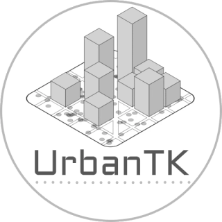

  

<h1 align="center">The Urban Toolkit</h1>

<strong>A suite of tools for urban visual analytics</strong>

The Urban Toolkit (UrbanTK) is a growing ecosystem of open-source tools, frameworks, knowledge bases, and methods designed to simplify and accelerate urban data visualization and analysis. It enables researchers, experts, and developers to explore complex urban phenomena through high-level visual grammars, map-centric interactions, and curated datasets.

**Every project, with its papers, code, and team, is on [urbantk.org](https://urbantk.org).**

## The ecosystem

- **[Grammars & toolkits](https://urbantk.org/#grammars)**: declarative grammars and toolkits for authoring urban visualizations and visual analytics systems, from street-overlaid visualizations to 2D and 3D maps.
- **[Dataflow frameworks](https://urbantk.org/#dataflow)**: dataflow-based frameworks where domain experts, developers, and AI assistants build urban visual analytics together, tracking the provenance of code and visualizations.
- **[Knowledge bases & guidelines](https://urbantk.org/#knowledge)**: surveys, studies, and knowledge bases on how urban visual analytics systems are designed and built.
- **[AI & ML](https://urbantk.org/#ai-ml)**: machine learning for urban data at city scale, from sunlight and shadows to sidewalk networks and materials and visibility in 3D cities.

## Links

- [Papers](https://urbantk.org/papers/), [news](https://urbantk.org/news/), and [team](https://urbantk.org/team/)
- [Discord](https://discord.gg/ajT6wF8TmN) for questions, or open an issue in a project's repository
- [Awesome Urban Datasets](https://github.com/urban-toolkit/awesome-urban-datasets): a curated list of open urban datasets
- [Tutorial](https://github.com/urban-toolkit/tutorial): high-level grammars for visualization and visual analytics (SIBGRAPI 2023)

## Support

Our work has been supported by the National Science Foundation (NSF awards [#2320261](https://www.nsf.gov/awardsearch/showAward?AWD_ID=2320261), [#2330565](https://www.nsf.gov/awardsearch/showAward?AWD_ID=2330565), and [#2411223](https://www.nsf.gov/awardsearch/showAward?AWD_ID=2411223)), the Discovery Partners Institute (DPI), and IDOT.
